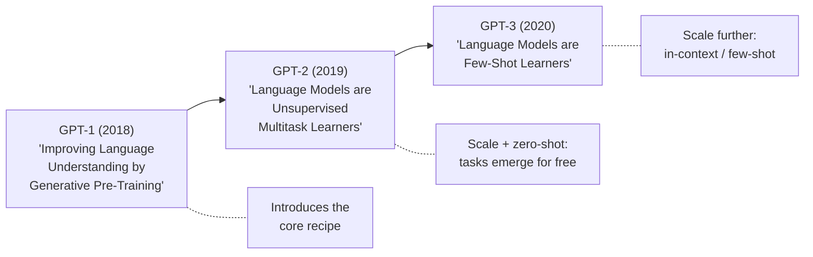
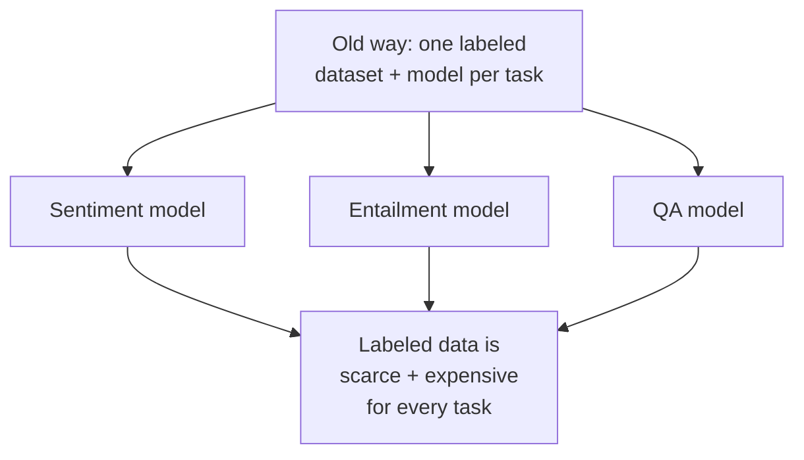
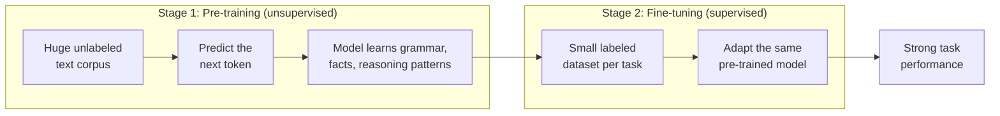
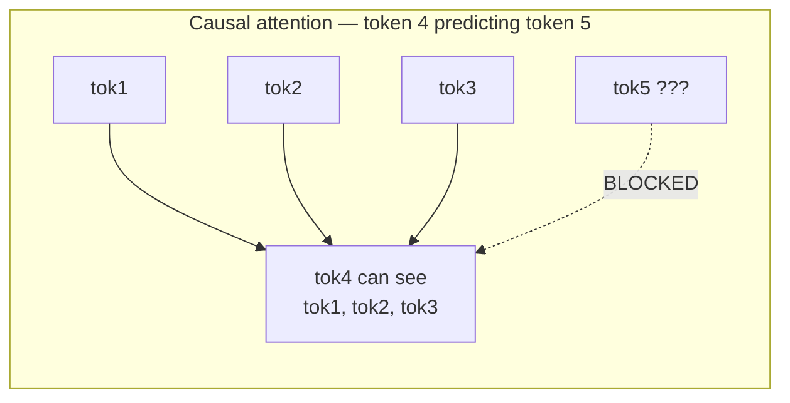
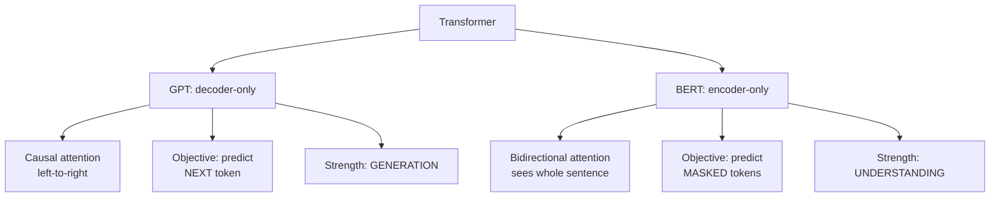
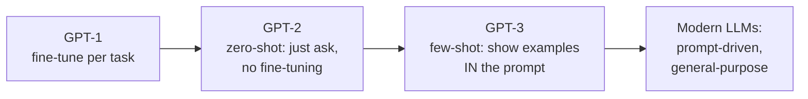
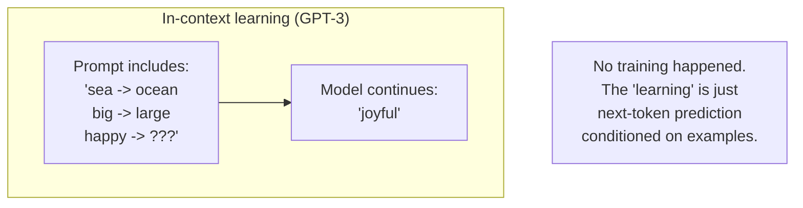
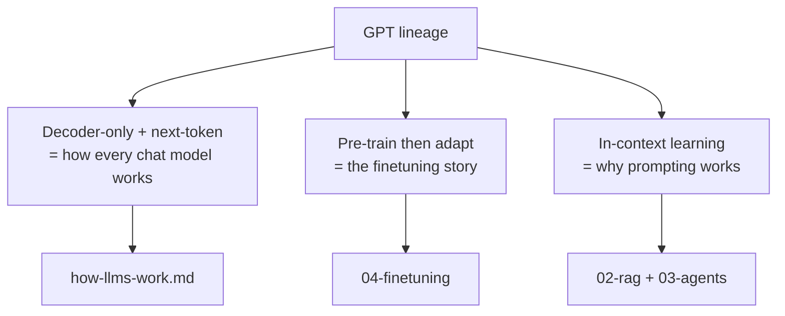

# GPT Study Guide — Generative Pre-Training

> **Key takeaway:** GPT's core idea is *generative pre-training* — train a decoder-only Transformer to predict the next token on a huge unlabeled corpus, then adapt that one general model to many tasks. It's the lineage every modern chat model descends from.

This is a study guide for the GPT paper(s), in the style of the other Module 1 docs. Read it alongside the original paper; keep your own takeaways in a separate note.

---

## Table of contents

1. [Which "GPT paper"?](#1-which-gpt-paper)
2. [The problem GPT-1 set out to solve](#2-the-problem-gpt-1-set-out-to-solve)
3. [The two-stage recipe](#3-the-two-stage-recipe)
4. [Why decoder-only](#4-why-decoder-only)
5. [GPT vs BERT — the fork in the road](#5-gpt-vs-bert--the-fork-in-the-road)
6. [The scaling story: GPT-2 and GPT-3](#6-the-scaling-story-gpt-2-and-gpt-3)
7. [Why this is foundational](#7-why-this-is-foundational)
8. [Reading checklist](#8-reading-checklist)

---

## 1. Which "GPT paper"?

"The GPT paper" is ambiguous — there are several, and they make different points.

- **GPT-1** is the *foundational* one — it introduces generative pre-training + fine-tuning. This is the one that pairs with Attention and BERT in your reading list.
- **GPT-2** is the "scale it up and tasks appear without task-specific training" paper.
- **GPT-3** is the "scale much further and the model learns from examples *in the prompt*" paper — the birth of in-context learning.

This guide centers on GPT-1's idea, then traces the scaling arc, because that arc is what actually explains modern LLMs.

---

## 2. The problem GPT-1 set out to solve

Before GPT, the dominant pattern was **supervised learning per task**: collect a labeled dataset for sentiment, another for entailment, another for question answering, and train a separate model each time.

The bottleneck: labeled data is expensive and limited, while *unlabeled* text (the open web, books) is essentially infinite. GPT-1's bet was to exploit that abundance — learn general language ability from unlabeled text first, then specialize with only a little labeled data.

---

## 3. The two-stage recipe

GPT-1's contribution is a two-stage process. (Note: this is the *original* GPT-1 framing. Modern chat models extend stage 2 — see the training-stages section of [how-llms-work.md](./how-llms-work.md).)

**Stage 1 — generative pre-training.** Train a Transformer to predict the next token across a large corpus. No labels needed; the text *is* the supervision (the "answer" is just the next word). This is exactly the next-token objective from [how-llms-work.md](./how-llms-work.md).

**Stage 2 — discriminative fine-tuning.** Take that pre-trained model and fine-tune it on a specific labeled task. Because the model already understands language, it needs far less task-specific data and trains faster.

The insight that made it land: **most of the useful learning happens in stage 1, for free.** The expensive labeled step becomes a light touch-up rather than the whole job.

---

## 4. Why decoder-only

GPT uses the **decoder** half of the original Transformer, with one defining property: **causal (masked) self-attention** — each token may only attend to tokens *before* it, never ahead.

Why this matters: to *generate* text you must predict the next token without seeing the future — otherwise the model could cheat by peeking at the answer. The causal mask enforces exactly that constraint, which is what makes the model a genuine generator rather than just a reader.

This is the deep reason GPT-style models generate fluently while encoder models (BERT) don't: the training objective and the attention pattern are built for left-to-right production.

---

## 5. GPT vs BERT — the fork in the road

GPT (2018) and BERT (2018) appeared almost together and took opposite design choices from the same Transformer foundation. You have both study guides, so it's worth holding the contrast explicitly.

| | **GPT** | **BERT** |
| --- | --- | --- |
| Architecture | Decoder-only | Encoder-only |
| Attention | Causal (left-to-right) | Bidirectional |
| Training objective | Next-token prediction | Masked-token prediction |
| Natural strength | Generating text | Classifying / understanding text |
| Where it led | Chatbots, code, completion | Search, embeddings, classification |

The historical punchline: BERT looked dominant early for understanding tasks, but **GPT's generative direction is what scaled into the chat models that define the field today.** The ability to *produce* text turned out to be the more general capability.

---

## 6. The scaling story: GPT-2 and GPT-3

This is the arc that turns GPT from "a clever 2018 method" into "the reason modern AI looks the way it does."

**GPT-2** showed that a big enough pre-trained model could do many tasks *without* the stage-2 fine-tuning at all — you just phrase the task as text and it responds. Tasks emerged as a side effect of scale.

**GPT-3** pushed scale dramatically further and revealed **in-context learning**: put a few examples of the task directly in the prompt, and the model adapts on the fly with no weight updates at all.

This is profound and also demystifying: "few-shot learning" isn't the model *training* on your examples — it's the same next-token prediction from [how-llms-work.md](./how-llms-work.md), now conditioned on examples you placed in the context. It connects directly to two later topics:

- **Prompting and context engineering** — putting the right examples/instructions in the prompt is the whole game in [02-rag](../02-rag/README.md).
- **Chain-of-Thought** — prompting the model to show reasoning steps (your `03` paper) is in-context learning applied to reasoning.

---

## 7. Why this is foundational

GPT matters to your curriculum for three concrete reasons, each linking forward:

1. **It defines the architecture you'll use every day.** Almost every model you call in this curriculum is a GPT-style decoder-only model. Understanding the family is understanding your primary tool.
2. **It frames the train-then-adapt mental model** that the finetuning module ([04-finetuning](../04-finetuning/README.md)) builds on — including *when not to* finetune, since in-context learning often removes the need.
3. **It explains why prompting works at all.** In-context learning is the theoretical basis for prompt and context engineering — the highest-leverage skill in [02-rag](../02-rag/README.md).

---

## 8. Reading checklist

When you read the source, target these — and after, write 2-3 sentences per point **in your own words** in your separate notes (the comprehension test):

- [ ] Why unlabeled text is such a powerful training signal (the data-abundance argument)
- [ ] The two stages: generative pre-training, then task fine-tuning
- [ ] What "causal / masked" attention is and why generation requires it
- [ ] How GPT's choices differ from BERT's, and why generation generalized better
- [ ] The scaling arc: fine-tune (GPT-1) -> zero-shot (GPT-2) -> few-shot / in-context (GPT-3)
- [ ] Why in-context learning is *not* training, just conditioned prediction

**Minimum useful read:** GPT-1 for the recipe + the GPT-3 few-shot idea for where it led. GPT-2 is optional connective tissue. You don't need to read all three end-to-end to get the foundational picture.

---

## How this connects forward

- **Next-token prediction + decoder-only mechanics** ← [how-llms-work.md](./how-llms-work.md)
- **GPT vs BERT contrast** ← pairs with your BERT study guide
- **In-context learning -> prompting & context engineering** -> [02-rag](../02-rag/README.md)
- **In-context learning -> Chain-of-Thought reasoning** -> [03-agents](../03-agents/README.md)
- **Pre-train then adapt -> when (not) to finetune** -> [04-finetuning](../04-finetuning/README.md)
