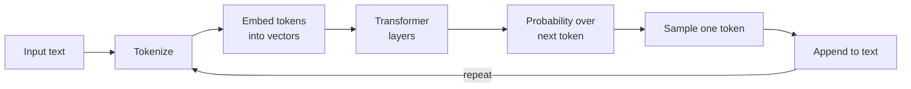
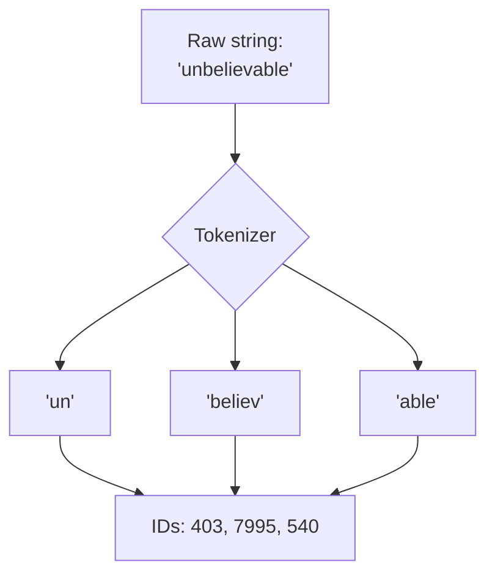
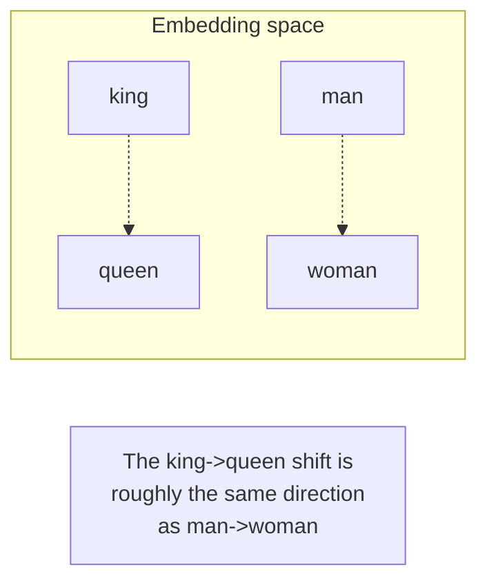
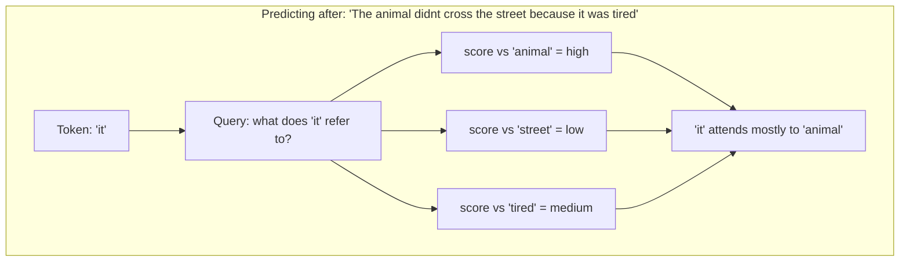
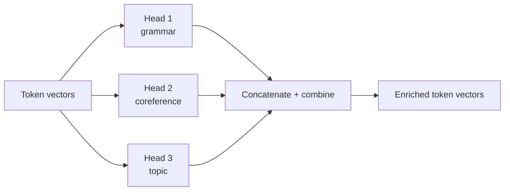
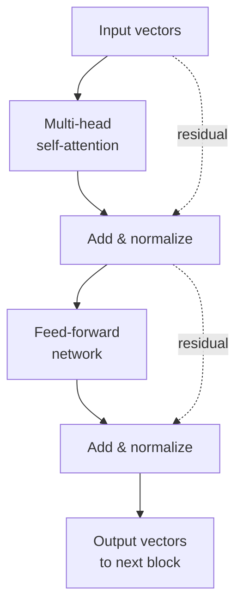
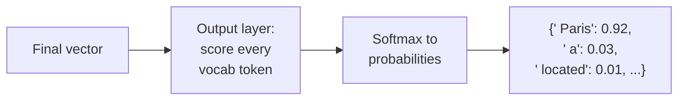
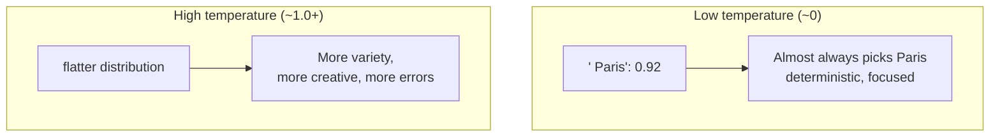
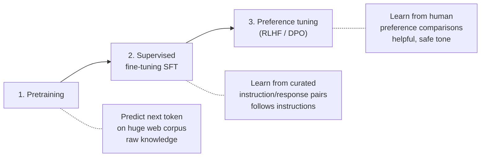
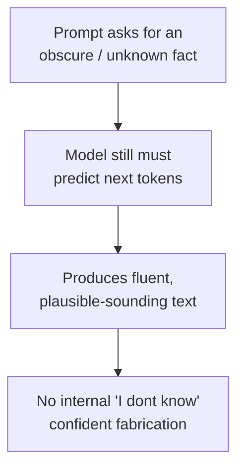

# How LLMs Work

> **Key takeaway:** An LLM is fundamentally a *next-token predictor*. It reads a sequence of tokens and outputs a probability distribution over what comes next. Chat, reasoning, code, and tool use are all emergent behaviors layered on top of that one mechanism.

This is a reference guide. Read it for the concepts; keep your own working notes in a separate file.

---

## Table of contents

1. [The big picture](#1-the-big-picture)
2. [Tokenization](#2-tokenization)
3. [Embeddings](#3-embeddings)
4. [The Transformer & attention](#4-the-transformer--attention)
5. [Next-token prediction](#5-next-token-prediction)
6. [Sampling: turning probabilities into text](#6-sampling-turning-probabilities-into-text)
7. [Training in three stages](#7-training-in-three-stages)
8. [Why LLMs hallucinate](#8-why-llms-hallucinate)
9. [Papers](#9-papers)

---

## 1. The big picture

At the highest level, everything an LLM does fits in one loop: take the text so far, predict the next token, append it, repeat.



The model has no memory between requests and no "thoughts" outside this loop. When it appears to reason or plan, that behavior is encoded in the patterns it learned during training and surfaced one token at a time.

**Worked example.** Give the model `The capital of France is`:

1. Tokenizes to roughly `["The", " capital", " of", " France", " is"]`
2. Runs those through the network
3. Produces a distribution like `{" Paris": 0.92, " a": 0.03, " located": 0.01, ...}`
4. Samples `" Paris"`, appends it
5. Feeds `The capital of France is Paris` back in and predicts again (maybe `.` or ` ,`)

That's the whole engine. The rest of this guide explains each box.

---

## 2. Tokenization

> A **token** is a chunk of text — usually a sub-word, not a whole word. Models operate on token IDs (integers), never on raw characters or words directly.

### Why sub-words?

There's a tension between two extremes:

| Approach | Vocabulary size | Problem |
| --- | --- | --- |
| One token per **character** | Tiny (~100) | Sequences become extremely long; model wastes capacity relearning spelling |
| One token per **word** | Huge (millions) | Can't handle unseen words, typos, or rare terms; vocab explodes |
| One token per **sub-word** | Moderate (~30k-100k) | **The sweet spot** - common words stay whole, rare words split into pieces |

Sub-word tokenization (BPE - Byte-Pair Encoding, and variants) is the standard. Common words like `the` get their own token; a rare word like `tokenization` might split into `token` + `ization`.

### What splitting actually looks like

```
"The capital of France is Paris."
   |  tokenize
["The"][" capital"][" of"][" France"][" is"][" Paris"]["."]
   |  map to IDs
[464, 5565, 286, 4881, 318, 6342, 13]
```

Notice the leading spaces are part of the tokens (`" capital"` not `"capital"`). That's why spacing and formatting can subtly change token counts.

### Diagram: the tokenization boundary



### Why this matters in practice

- **Cost and limits are measured in tokens, not words.** A rough English rule of thumb: ~1 token ≈ 0.75 words, or ~4 characters. So 1,000 tokens ≈ 750 words.
- **Non-English text and code often use more tokens per character**, because the tokenizer was trained mostly on English.
- **Whitespace, emoji, and rare symbols can be surprisingly expensive.**

> **Try it:** paste a sentence into a tokenizer visualizer and count the tokens. Watch where it splits words you didn't expect. This single experiment makes context limits and pricing intuitive - both covered in [practical-constraints.md](./practical-constraints.md).

---

## 3. Embeddings

> An **embedding** turns each token ID into a dense vector of numbers - a point in high-dimensional space where *similar meanings sit close together*.

A token ID like `6342` ("Paris") is just an index - it carries no meaning. The embedding layer looks it up in a big table and returns a vector, e.g. a list of 768 (or 4,096, etc.) floating-point numbers. Those numbers *are* the model's representation of meaning.

### The intuition: meaning as geometry

In embedding space, distance and direction encode relationships. The classic illustration:

```
vector("king") - vector("man") + vector("woman") ~= vector("queen")
```



Words used in similar contexts end up with similar vectors. "Paris" sits near "London" and "Tokyo"; "happy" sits near "joyful."

### Two senses of "embedding" - don't confuse them

1. **Token embeddings (here):** internal to the model, one per token, the *input* to the transformer.
2. **Sentence/document embeddings (Module 02):** a single vector representing a whole chunk of text, used for retrieval in RAG.

They share the core idea - meaning as a vector - but operate at different granularities. The RAG version is covered in [02-rag](../02-rag/README.md).

### Positional information

Embeddings alone don't tell the model *where* a token sits in the sequence. "Dog bites man" and "Man bites dog" use the same tokens. So models add **positional encoding** - extra information injected into each token's vector so order is preserved. Keep this conceptual for now; the mechanism varies by model.

---

## 4. The Transformer & attention

> **Attention** lets each token look at every other token in the sequence and decide how much each one matters for what comes next. The Transformer is the architecture built around stacking attention.

This is the 2017 breakthrough ("Attention is All You Need") that made modern LLMs possible.

### The problem it solved

Earlier models (RNNs) read text one token at a time, left to right, carrying a running summary. Two weaknesses:

- **Long-range memory decayed** - by the end of a long paragraph, the start was fuzzy.
- **No parallelism** - each step depended on the previous one, so training was slow.

Attention fixes both: every token can directly "see" every other token, and it all happens in parallel.

### The intuition: query, key, value

Think of each token as doing a tiny database lookup against all the other tokens.

- **Query (Q):** what *this* token is looking for
- **Key (K):** what each *other* token offers
- **Value (V):** the actual information each other token carries

For each token, the model compares its query to every key (a similarity score), turns those scores into weights, and produces a weighted blend of the values.



In that example, attention is how the model figures out that "it" refers to "the animal," not "the street" - by assigning a high attention weight from "it" to "animal."

### Multi-head attention

The model doesn't do this just once. It runs many attention "heads" in parallel, each learning to focus on different kinds of relationships - one head might track grammatical subject/object, another might track long-range topic, another nearby word order.



### A full transformer block

A model stacks many identical blocks (GPT-style models have dozens). Each block has two main sub-layers:



- **Attention sub-layer:** mixes information *between* tokens
- **Feed-forward sub-layer:** processes *each* token's vector individually, adding capacity to compute
- **Residual connections** (the dotted lines) let information skip around layers, which makes very deep stacks trainable
- **Normalization** keeps the numbers in a stable range

> **Watch out for:** trying to fully derive the attention math (the softmax, the scaling factor, the matrix shapes) on a first pass. Get the Q/K/V intuition rock-solid first. The math is much easier to absorb once the concept is concrete - and you don't need it to ship the Module 1 project.

### Decoder-only vs encoder-only - GPT vs BERT

| | **GPT (decoder-only)** | **BERT (encoder-only)** |
| --- | --- | --- |
| Reads | Left to right only (can't peek ahead) | Both directions at once |
| Trained to | Predict the *next* token | Fill in *masked* tokens |
| Best at | **Generating** text | **Understanding/classifying** text |
| Powers | Chatbots, code, completion | Search, embeddings, classification |

Modern generative LLMs are decoder-only. The left-to-right ("causal") constraint is what makes generation possible - the model can't cheat by looking at the answer.

---

## 5. Next-token prediction

After the final transformer block, the model has a rich vector for the last position. One more layer converts that vector into a score for *every token in the vocabulary*, and a softmax turns those scores into probabilities.



So the literal output is not a word - it's a probability distribution over the *entire* vocabulary (tens of thousands of options), every single step.

This reframes a lot:

- The model never "knows" an answer; it estimates which token is *most plausible* next given everything it has seen.
- "Reasoning" emerges because plausible continuations of a well-posed problem tend to be correct steps. This is also why prompting the model to "think step by step" helps - it makes each next token an easier, more constrained prediction (the Chain-of-Thought idea, explored in [03-agents](../03-agents/README.md)).

---

## 6. Sampling: turning probabilities into text

Given the distribution, how do we pick the actual next token? This is **sampling**, and it's controlled by a few key parameters.

### Temperature

Scales how "confident" or "adventurous" the pick is.



- **Low temperature** -> repeatable, factual, boring. Good for extraction, classification, code.
- **High temperature** -> diverse, creative, riskier. Good for brainstorming, fiction.

### Top-p (nucleus) and top-k

Ways to cut off the long tail of unlikely tokens so the model doesn't occasionally pick something bizarre.

- **Top-k:** only consider the k most likely tokens.
- **Top-p (nucleus):** only consider the smallest set of tokens whose probabilities add up to p (e.g. 0.9).

| Parameter | What it controls | Typical use |
| --- | --- | --- |
| Temperature | Overall randomness | 0 for factual, 0.7-1.0 for creative |
| Top-p | Trims unlikely tail | 0.9 is a common default |
| Top-k | Hard cap on candidates | Less common now; top-p preferred |

> **Practical note:** for anything where you want consistency - data extraction, structured output, evals - set temperature low. You'll see this again when building reliable pipelines in [05-production](../05-production/README.md).

---

## 7. Training in three stages

How does the model learn to predict well? Modern chat LLMs go through roughly three stages.



1. **Pretraining** - the model reads an enormous text corpus and just predicts the next token, over and over. This is where it absorbs grammar, facts, and reasoning patterns. Hugely expensive; produces a "base model" that completes text but doesn't reliably follow instructions.
2. **Supervised fine-tuning (SFT)** - trained on curated examples of instructions paired with good responses. Now it behaves like an assistant.
3. **Preference tuning (RLHF / DPO)** - humans (or models) rank competing responses; the model is nudged toward the preferred style. This is where "helpful, harmless, honest" tone gets shaped. (Covered more in [04-finetuning](../04-finetuning/README.md); the foundational idea is the InstructGPT paper.)

The key insight: **pretraining gives knowledge, fine-tuning gives behavior.** When people say "finetune the model," they almost always mean stages 2-3, not stage 1.

---

## 8. Why LLMs hallucinate

Now that the mechanism is clear, hallucination stops being mysterious.

The model is *always* predicting plausible next tokens - never retrieving verified facts. When the training data strongly supports an answer, the plausible continuation is also the correct one. When it doesn't (an obscure fact, a made-up entity, a precise citation), the model still produces a fluent, confident-sounding continuation, because that's the only thing it does. It has no built-in signal for "I don't actually know this."



This is *the* reason RAG exists: instead of hoping the fact is baked into the weights, you retrieve it and put it in the prompt, turning a recall problem into a reading-comprehension problem. That's the entire premise of [Module 02](../02-rag/README.md).

---

## 9. Papers

Read these alongside this guide. After each, write a 2-3 sentence summary **in your own words** in your separate notes - that's the comprehension test.

- **Attention is All You Need** (Vaswani et al., 2017) - introduces the Transformer and self-attention. The foundation everything else sits on.
- **GPT** (Radford et al.) - decoder-only generative pretraining; the lineage of modern chat models.
- **BERT** (Devlin et al.) - encoder-only, bidirectional; great contrast to GPT for understanding *why* decoder-only won for generation.

Supplementary, once the above land: **InstructGPT / RLHF** (connects to the training-stages section), and **Chain-of-Thought** (connects to next-token reasoning).

---

## How this connects forward

- **Tokens -> cost & context limits** -> [practical-constraints.md](./practical-constraints.md)
- **Embeddings -> retrieval** -> [02-rag](../02-rag/README.md)
- **Next-token reasoning -> agents & Chain-of-Thought** -> [03-agents](../03-agents/README.md)
- **Training stages -> finetuning** -> [04-finetuning](../04-finetuning/README.md)
- **Hallucination -> why we need RAG and evals** -> [02-rag](../02-rag/README.md), [05-production](../05-production/README.md)
