# Practical Constraints: Context, Latency, Cost & Rate Limits

> **Key takeaway:** Capability is rarely the binding constraint in real systems - the binding constraints are how much you can fit in the prompt (context), how long it takes (latency), what it costs (tokens), and how often you're allowed to call (rate limits). Good AI engineering is mostly managing these four.

This is a reference guide. The *concepts and formulas* here are stable; the *specific numbers* (prices, window sizes) change monthly, so a dated snapshot is included and flagged - re-check before relying on it.

---

## Table of contents

1. [Why constraints, not capability, define the job](#1-why-constraints-not-capability-define-the-job)
2. [The context window](#2-the-context-window)
3. [Cost: how token billing actually works](#3-cost-how-token-billing-actually-works)
4. [Latency](#4-latency)
5. [Rate limits](#5-rate-limits)
6. [The four-way tradeoff](#6-the-four-way-tradeoff)
7. [A pricing snapshot (dated - re-check)](#7-a-pricing-snapshot-dated--re-check)
8. [Putting it together: the Module 1 project](#8-putting-it-together-the-module-1-project)

---

## 1. Why constraints, not capability, define the job

When you start, it's tempting to think the hard part is picking the smartest model. In production, the smart model is usually the easy part - the constraints are what break systems:

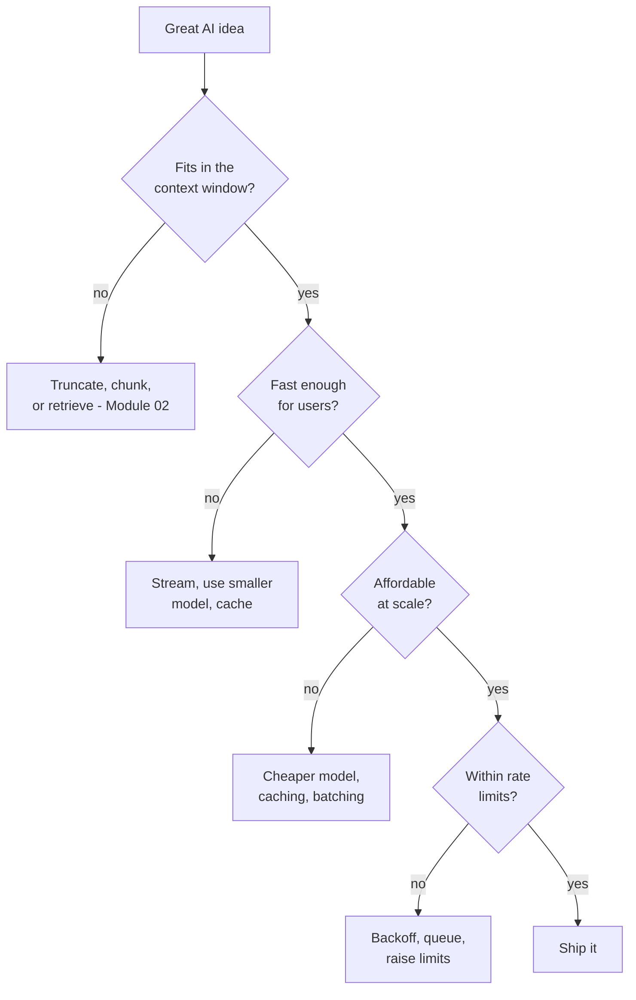

Every one of these constraints traces back to tokens (from [how-llms-work.md](./how-llms-work.md)) - they're the unit of context, the unit of cost, a major driver of latency, and what rate limits are measured in. Understanding tokens is what makes all four legible.

---

## 2. The context window

> The **context window** is the maximum number of tokens the model can consider at once - your entire prompt *plus* the response must fit inside it.

Everything shares one budget: system instructions, conversation history, retrieved documents, tool definitions, the user's message, and the model's reply.

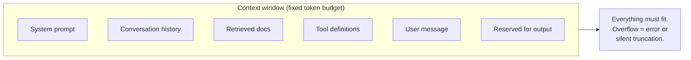

### Why it's a budget, not free real estate

Three reasons not to just "stuff everything in," even when the window is large:

1. **You pay for every input token** (see cost, below). A 1M-token context filled to the brim is expensive on every single call.
2. **Latency rises with input size** - more tokens to process means a slower first response.
3. **The "lost in the middle" effect** - models attend most reliably to the *start* and *end* of a long context; information buried in the middle is more likely to be overlooked. A bigger window doesn't guarantee the model *uses* the middle well.

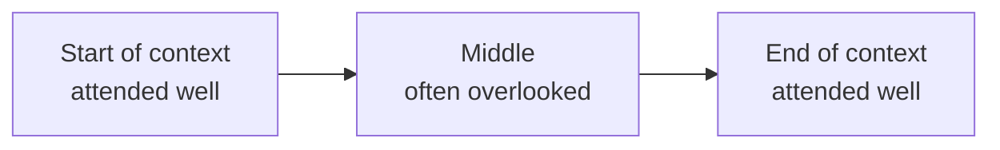

### The consequence

When content doesn't fit - or fits but dilutes attention - you don't just use a bigger window. You get *selective* about what goes in. That selectivity is exactly **context engineering and RAG**, the whole of [Module 02](../02-rag/README.md). The context window is the constraint that makes RAG necessary.

> **Rule of thumb:** reserve space for the output. If a model has a 200K window and you want a 4K-token answer, your input budget is ~196K, not 200K - and in practice you want healthy margin below that.

---

## 3. Cost: how token billing actually works

> You're billed per token, and **input and output are priced separately** - output is typically several times more expensive than input.

### The basic formula

```
cost = (input_tokens  / 1,000,000 x input_price_per_M)
     + (output_tokens / 1,000,000 x output_price_per_M)
```

### The asymmetry that surprises people

Output tokens commonly cost **3-8x** the input rate (a ~4x ratio is typical). Generating tokens one at a time is computationally heavier than reading the input in parallel - so long, chatty responses can dominate your bill even when the prompt is short.

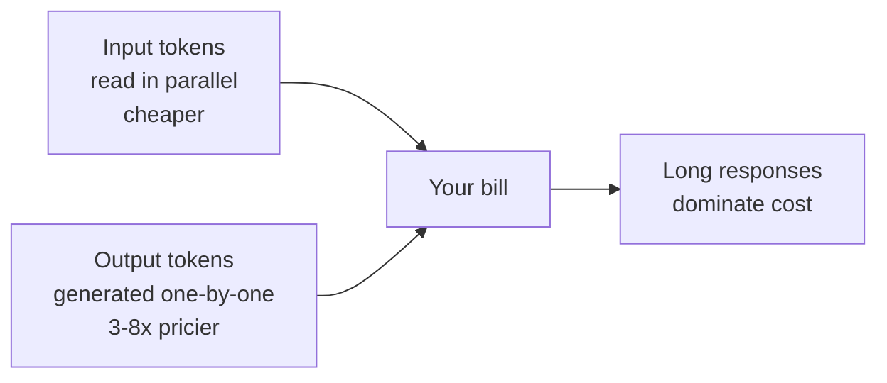

**Worked example.** Suppose input is $3/M and output is $15/M (a common mid-tier shape). A request with 2,000 input tokens and 500 output tokens:

```
input:  2000 / 1e6 x $3  = $0.006
output:  500 / 1e6 x $15 = $0.0075
total = $0.0135 per request
```

Tiny - until you multiply by volume. At 500 requests/day for 30 days that's 15,000 calls = **~$202/month**, and that's before conversation history makes each input larger over time.

### The two levers that cut cost dramatically

Most providers offer both - learn them early, they're often the difference between viable and not:

| Lever | What it does | Typical savings |
| --- | --- | --- |
| **Prompt caching** | Reuse a repeated prefix (big system prompt, static docs) at a reduced rate instead of re-billing it every call | Up to ~90% off the cached portion |
| **Batch processing** | Submit many requests for async (non-realtime) processing | ~50% off input and output |

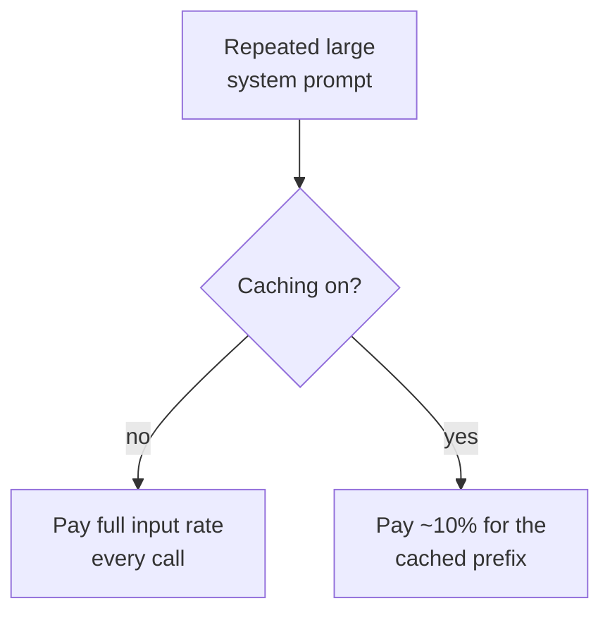

Caching is especially powerful for chatbots and agents, where the same long system prompt rides along on every single call. You'll lean on these again when making pipelines economical in [05-production](../05-production/README.md).

> **Watch out for:** conversation history silently inflating cost. Each turn you resend the whole history (the model is stateless - see [the-ai-stack.md](./the-ai-stack.md)), so input tokens grow every turn. Long chats get quadratically expensive if you never trim or summarize.

---

## 4. Latency

> **Latency** is how long the user waits. For LLMs it splits into two parts that you optimize differently.

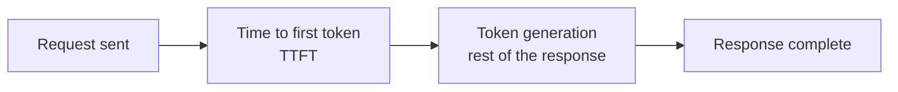

- **Time to first token (TTFT)** - the initial wait before *anything* appears. Driven largely by input size (the model must process the whole prompt first) and model size.
- **Generation time** - how fast tokens stream out after that, driven by output length and model speed.

### Levers for each

| Symptom | Lever |
| --- | --- |
| Slow first token (high TTFT) | Shrink the input; use a smaller/faster model; prompt caching can help |
| Slow overall stream | Cap `max_tokens`; pick a faster model tier; **stream** the response |
| *Feels* slow even when fast | **Stream** - perceived latency drops the moment text starts appearing |

Streaming (covered in [the-ai-stack.md](./the-ai-stack.md)) doesn't reduce total time, but it transforms the *experience* - which is why nearly every chat UI streams.

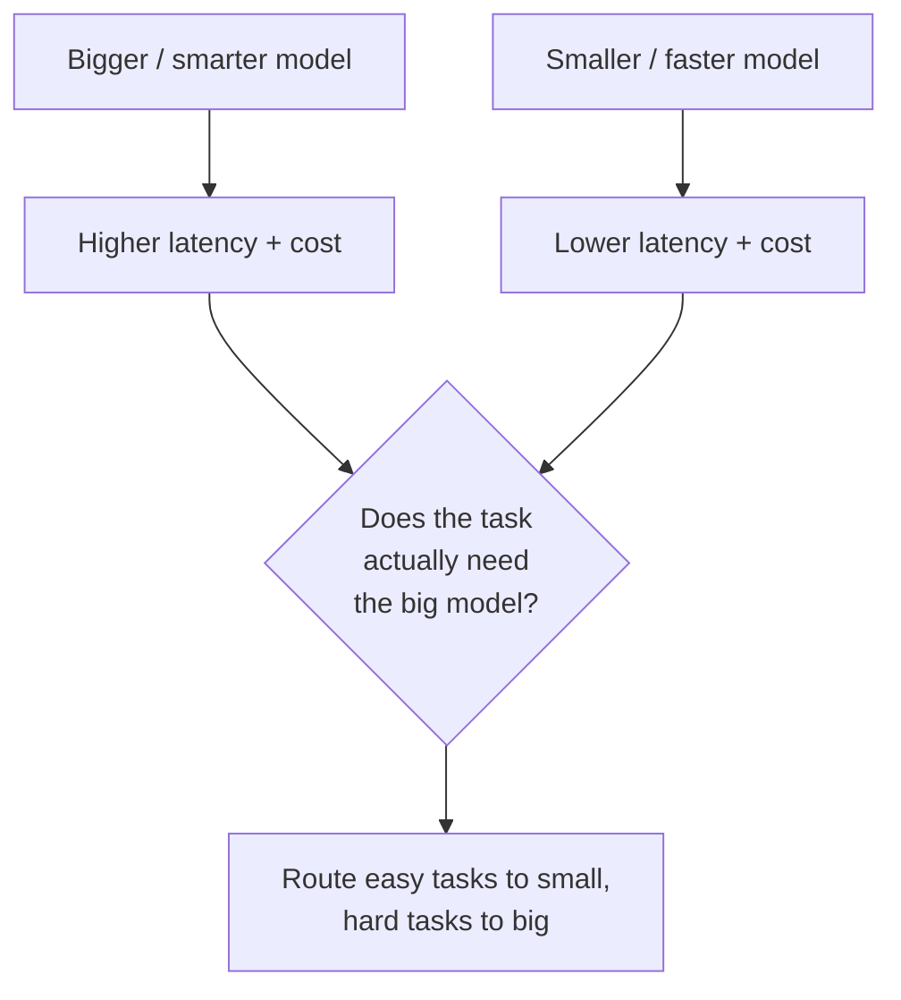

That last pattern - **model routing** - is one of the highest-leverage production tricks: most requests don't need your most powerful model.

---

## 5. Rate limits

> Providers cap how much you can call them, usually along two axes at once: **requests per minute (RPM)** and **tokens per minute (TPM)**. You hit whichever you reach first.

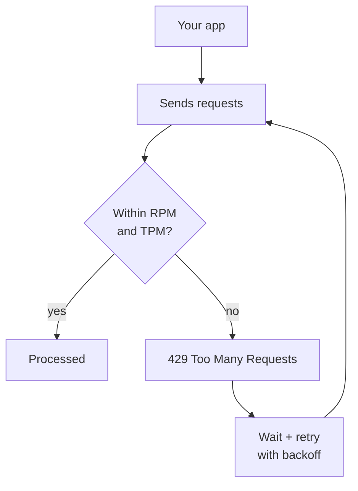

### How to live within them

- **Exponential backoff** - on a `429`, wait, then retry with progressively longer delays (e.g. 1s, 2s, 4s) plus a little randomness ("jitter") so many clients don't retry in lockstep.
- **Queueing** - smooth bursty traffic into a steady rate rather than firing everything at once.
- **Tier upgrades** - limits usually rise as your account/usage tier increases.
- **Spread load** - batch where realtime isn't needed; consider multiple models/providers for very high volume.

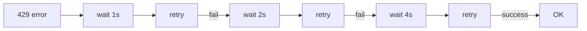

> **Watch out for:** rate limits turn an app that works in testing into one that falls over under real traffic. Build retry-with-backoff in from the start - it's a few lines and saves a production incident.

---

## 6. The four-way tradeoff

The constraints aren't independent - pulling one lever moves the others. The central tension:

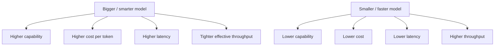

There is no universally "best" model - only the best fit for a task's constraints. The mature move is **tiered routing**: send simple, high-volume work to a small fast model, and reserve the expensive frontier model for the genuinely hard requests. Keep this in mind from your very first project; it's the single most repeated production pattern.

---

## 7. A pricing snapshot (dated - re-check)

> **As of May 2026.** These numbers move fast - industry prices dropped roughly 80% from 2025 to 2026. Treat this as a *shape*, not a source of truth. Always confirm against the provider's current pricing page before you rely on it. Prices are per **million tokens**, shown as input / output.

| Tier | Example rates (in / out per 1M) | Notes |
| --- | --- | --- |
| Budget | ~$0.10-0.15 / ~$0.40-0.60 | Cheapest capable models; great for high-volume simple tasks |
| Mid / workhorse | ~$2.50-3 / ~$10-15 | The common production default for quality-vs-cost balance |
| Premium / frontier | ~$5-30 / ~$25-180 | Reserve for hard reasoning; can be 10x+ the workhorse on output |

Context windows at the time of writing commonly range from ~128K up to ~1M+ tokens depending on the model. Two cross-cutting facts that have held steady:

- **Output costs several times more than input** (~4x typical) - budget output aggressively.
- **Prompt caching (~90% off cached input) and batch APIs (~50% off) are near-universal** - the two biggest cost levers.

> Because these specifics date quickly, this is the note to pair with a quick web check whenever you're estimating a real budget. The *formulas* in section 3 don't expire; the *rates* do.

---

## 8. Putting it together: the Module 1 project

Your Module 1 project - a small app that calls an LLM, streams the response, and **tracks token cost per request** - is really a constraints exercise in disguise. To build it you'll touch all four:

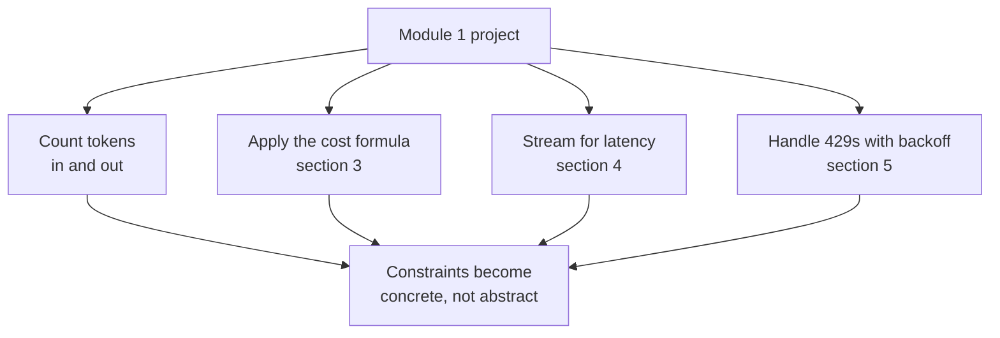

Concretely, aim to: read the token counts the API returns, multiply by current rates to show a live per-request cost, stream the output so it feels responsive, and wrap the call in retry-with-backoff. Do that and these four constraints stop being theory.

---

## How this connects forward

- **Tokens as the underlying unit** builds on [how-llms-work.md](./how-llms-work.md)
- **Statelessness inflating context** ties to [the-ai-stack.md](./the-ai-stack.md)
- **Context window -> why we retrieve selectively** -> [02-rag](../02-rag/README.md)
- **Cost/latency control, routing, caching at scale** -> [05-production](../05-production/README.md)
