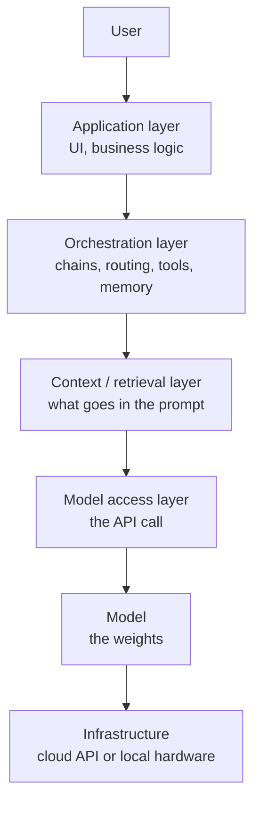
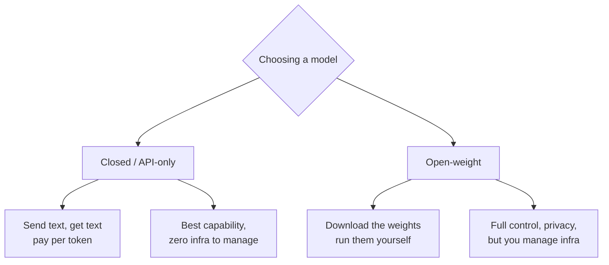
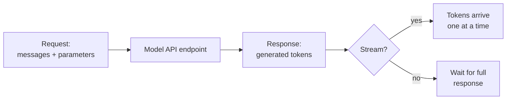
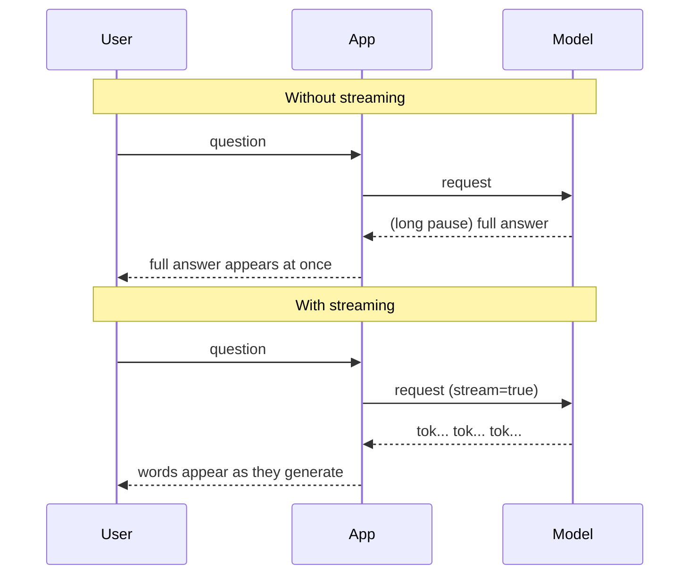
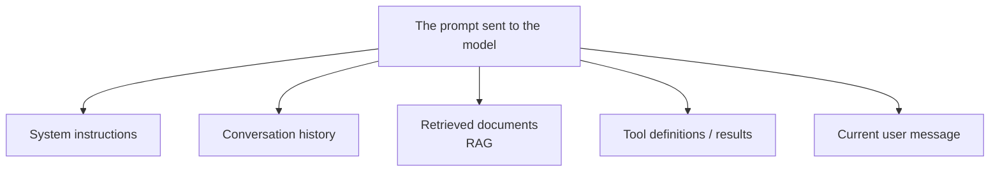
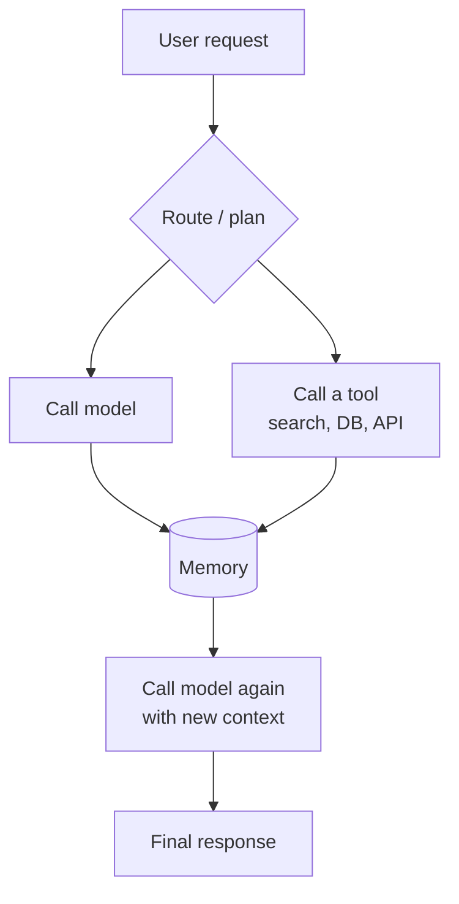
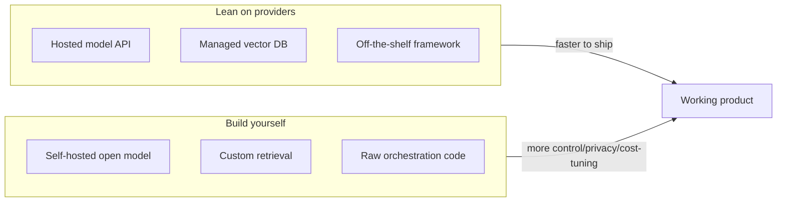
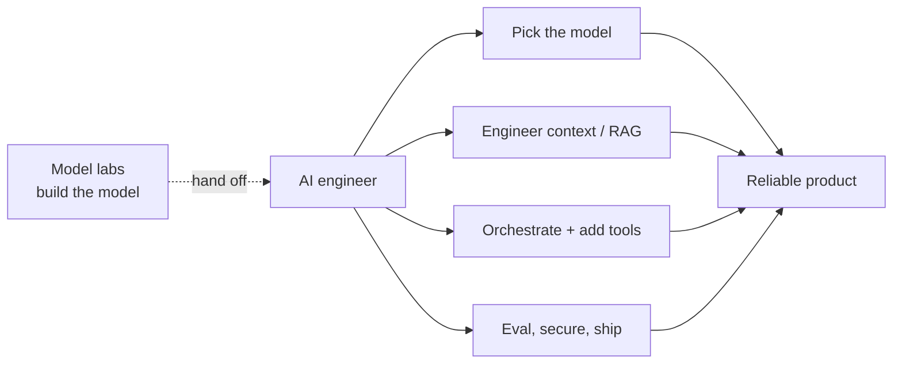

# The Modern AI Stack

> **Key takeaway:** You rarely build the model. AI engineering is mostly *orchestration* - the model is one layer in a stack you assemble, and your job is choosing the layers and wiring them together well.

This is a reference guide. Read it for the concepts; keep your own working notes in a separate file.

---

## Table of contents

1. [The big picture](#1-the-big-picture)
2. [Layer by layer](#2-layer-by-layer)
3. [Model providers: closed vs open](#3-model-providers-closed-vs-open)
4. [The API layer: how you actually call a model](#4-the-api-layer-how-you-actually-call-a-model)
5. [The context layer](#5-the-context-layer)
6. [The orchestration layer](#6-the-orchestration-layer)
7. [Build vs buy at each layer](#7-build-vs-buy-at-each-layer)
8. [Where AI engineering actually happens](#8-where-ai-engineering-actually-happens)

---

## 1. The big picture

A useful mental model: the LLM is an engine, but a car needs a lot more than an engine to be useful. The "AI stack" is everything you bolt around the model to turn raw prediction into a product.

Most of your time as an AI engineer is spent in the **orchestration** and **context** layers - not building models, and not even mostly writing application UI. That's the thesis of this whole guide.

---

## 2. Layer by layer

A rough map of the stack and where each layer is covered in this curriculum.

| Layer | What it does | Module |
| --- | --- | --- |
| **Application** | The product the user touches - UI, auth, business logic | All |
| **Orchestration** | Chains calls, manages control flow, routes to tools, holds memory | [03-agents](../03-agents/README.md) |
| **Context / retrieval** | Decides what information goes into each prompt | [02-rag](../02-rag/README.md) |
| **Model access** | The actual API call - request shape, streaming, retries | This module |
| **Model** | The weights doing next-token prediction | [04-finetuning](../04-finetuning/README.md) |
| **Infrastructure** | Where it runs: a hosted API, or your own hardware | [04-finetuning](../04-finetuning/README.md) |

You don't need all layers for every project. A simple app might be just Application -> Model access -> Model. Complexity is something you add when a problem demands it, not by default.

---

## 3. Model providers: closed vs open

The first real decision: whose model, running where?

### The core tradeoff

| | **Closed / API** | **Open-weight** |
| --- | --- | --- |
| Capability | Usually the frontier | Catching up, strong for many tasks |
| Setup effort | Just an API key | You host and scale it |
| Cost model | Per token | Per hour of hardware |
| Data privacy | Leaves your environment | Can stay fully in-house |
| Customization | Limited | Full (finetuning, quantization) |
| Best when | Speed to ship, top quality | Privacy, scale economics, control |

You'll revisit the open-weight side hands-on (Ollama, LoRA) in [04-finetuning](../04-finetuning/README.md). For Module 1, an API model is the fastest path to a working project.

> **Try it:** list 3-4 providers/models you might realistically use, and write one sentence each on when you'd reach for them. Revisit the list at the end of the curriculum - it'll change.

---

## 4. The API layer: how you actually call a model

This is the layer your Module 1 project lives in. Almost every hosted LLM exposes the same shape: a list of **messages**, each with a **role**.

### The message/role pattern

Three common roles:

- **system** - sets behavior and rules ("You are a helpful assistant that...")
- **user** - the human's input
- **assistant** - the model's previous replies (you send these back to maintain conversation history)

Because the model is stateless (see [how-llms-work.md](./how-llms-work.md) - no memory between calls), *you* resend the whole conversation each turn. The "memory" of a chat is an illusion maintained by replaying history.

### Key request parameters

| Parameter | Effect |
| --- | --- |
| `model` | Which model to call |
| `messages` | The conversation so far |
| `max_tokens` | Cap on response length (and cost) |
| `temperature` | Randomness (see sampling in how-llms-work.md) |
| `stream` | Whether to receive tokens incrementally |

### Streaming vs waiting

Streaming doesn't make generation faster - it makes it *feel* faster, because the user sees progress immediately instead of staring at a spinner. This is why almost every chat UI streams. Your project should too.

---

## 5. The context layer

> Everything the model knows about *your specific problem* has to fit in the prompt. The context layer is the discipline of deciding what goes in.

The model's built-in knowledge is frozen at training time and generic. To make it useful for your task, you assemble context:

This is its own deep discipline - "context engineering" - and it's the entire focus of [Module 02](../02-rag/README.md). For now, the key idea: the prompt is a budget (limited by the context window), and filling it wisely is one of the highest-leverage skills in the field.

---

## 6. The orchestration layer

For anything beyond a single call, you need logic that coordinates multiple steps. That's orchestration.

Orchestration handles: chaining multiple model calls, deciding when to call tools, retrying on failure, and maintaining memory across steps. When this logic becomes the *main* thing your system does - planning and acting in a loop - you've built an **agent**, which is all of [Module 03](../03-agents/README.md).

### Frameworks: LangChain, LangGraph

These exist to give you orchestration primitives out of the box. Worth recognizing now, going deep later:

- **LangChain** - building blocks for chaining LLM calls, tools, and prompts
- **LangGraph** - models agent control flow as a graph/state machine (great when flow gets non-linear)

> **Watch out for:** reaching for a heavy framework before you've felt the problem it solves. Build the raw version with direct API calls first - you'll understand what the framework is abstracting, and you'll know when the abstraction earns its weight. A surprising number of production systems are "just" well-organized direct API calls.

---

## 7. Build vs buy at each layer

A practical lens: at every layer you choose to use someone else's solution or build your own.

Early on, **buy/lean** at almost every layer - it gets you to a working system fastest, which is what matters while learning. Shift toward **build** only when a concrete constraint (cost at scale, data privacy, a capability gap) forces it. Premature building is the most common way side projects die.

---

## 8. Where AI engineering actually happens

Pulling it together. If model labs build the engine (the model), the AI *engineer's* job is everything around it: choosing the right model, engineering the context, orchestrating multi-step logic, wiring in tools, and making the whole thing reliable and observable.

Notice that three of those four engineer responsibilities map directly onto Modules 02, 03, and 05 of this curriculum. Module 01 - this one - is about understanding the engine well enough to make good decisions about everything bolted around it.

> **Write your own take:** after reading, answer in your separate notes - *which layers do you expect to spend most of your time in, and why?* Revisit at the end of the curriculum to see if your answer changed. That delta is a good measure of what you learned.

---

## How this connects forward

- **API layer + statelessness** builds on [how-llms-work.md](./how-llms-work.md)
- **Context layer** -> [02-rag](../02-rag/README.md)
- **Orchestration -> agents** -> [03-agents](../03-agents/README.md)
- **Open-weight models + infrastructure** -> [04-finetuning](../04-finetuning/README.md)
- **Reliability + observability** -> [05-production](../05-production/README.md)
